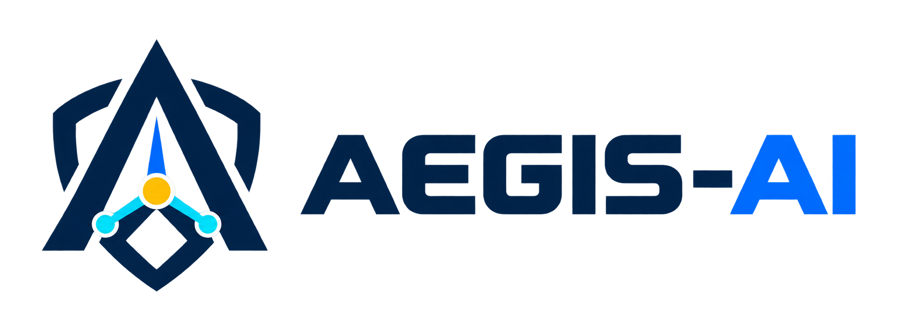
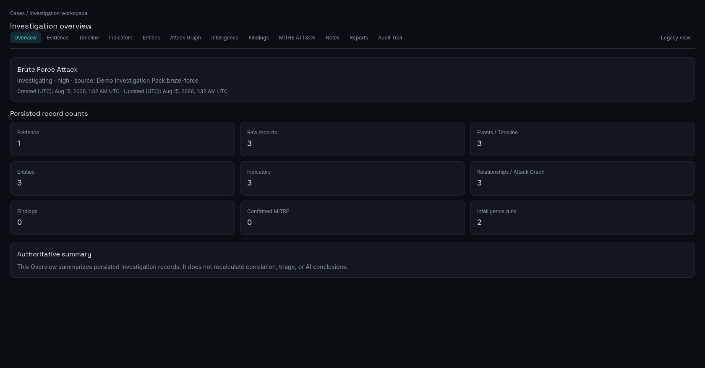
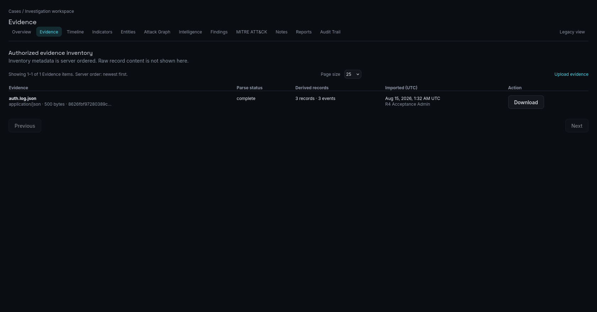
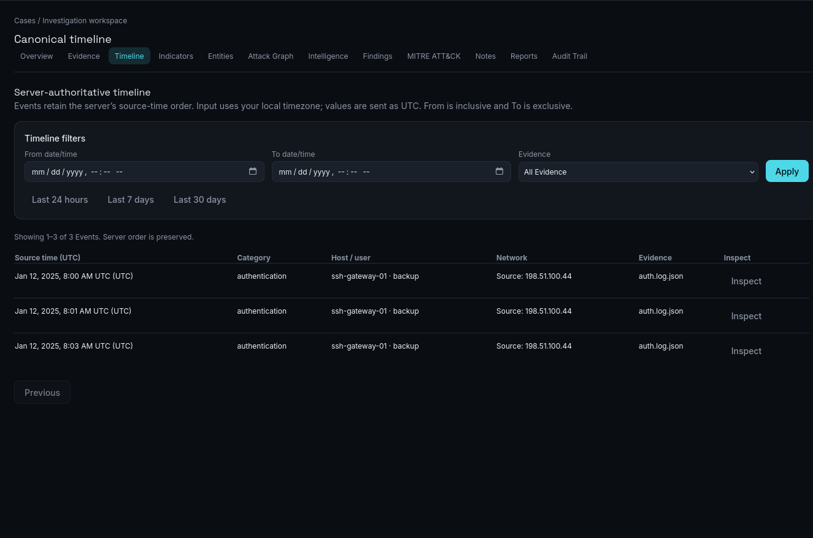
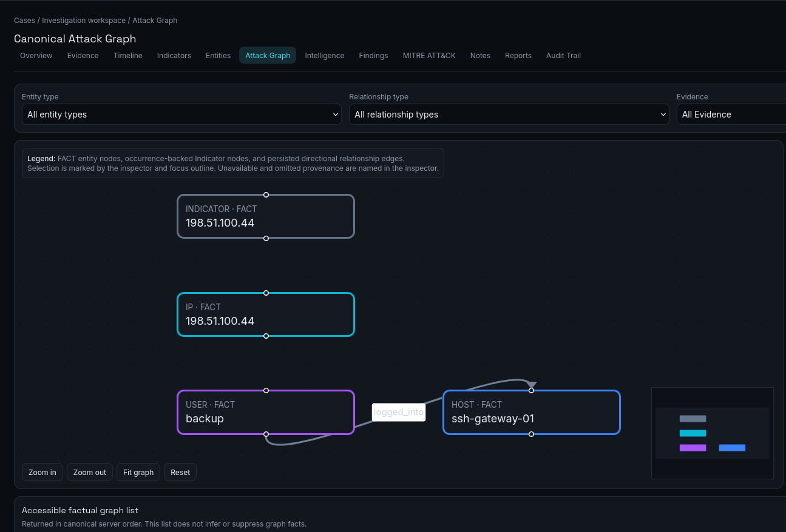
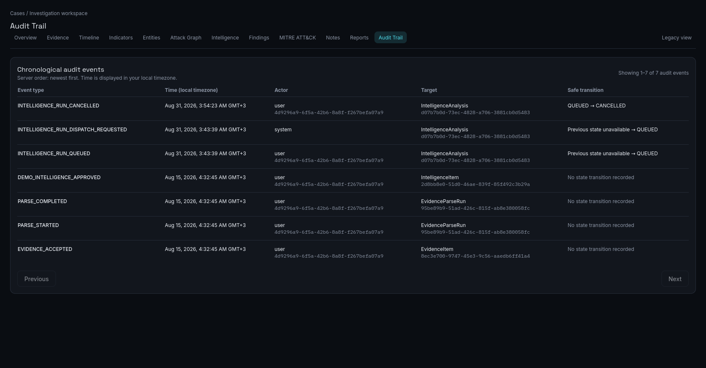

  

<h1 align="center">Aegis AI</h1>

A self-hosted, evidence-first investigation and decision layer for security telemetry.

Aegis AI sits above telemetry sources such as Wazuh. It turns authorized input into durable investigation context: evidence provenance, canonical alerts, explainable reconstruction, and analyst-controlled decisions. It is intended for controlled pilot use, not a public service. The boundaries are deliberate: correlation and triage are persisted rather than recomputed in the browser, and AI output remains a reviewable suggestion rather than security authority.

> **Independent project notice:** Aegis AI is an independent personal project. It is not an official Wazuh product and is not affiliated with Wazuh. Wazuh 4.9.2 is the only external integration validated end-to-end.

The current candidate is `v1.0.0-rc1`. It is not a final v1.0.0 announcement. The preserved V1-B3 single-machine revalidation accepted 280 of 300 returned workload requests at five events per second and did not complete the required workload. No throughput envelope, production-scale, Enterprise, high-availability, SaaS, or compliance claim is made.

## Product walkthrough

### 1. Investigation Overview

*Persisted investigation counts and authoritative record summary.* The Overview summarizes stored Investigation records; it does not recalculate correlation, triage, or AI conclusions.

### 2. Evidence

*Authorized evidence inventory with parse status and derived records.* Evidence metadata, parsing state, derived counts, provenance, and download access are bounded by the authorized evidence workflow.

### 3. Timeline

*Server-authoritative timeline with bounded provenance inspection.* Normalized events retain the server's source-time order and link back to the authorized evidence workflow.

### 4. Attack Graph

*Canonical factual graph with persisted relationships and bounded provenance.* The graph displays factual entity nodes, occurrence-backed indicators, and persisted directional relationships. It never upgrades AI suggestions into facts.

### 5. Audit Trail

*Chronological audit events with recorded actors, targets, and safe transitions.* A queued Intelligence Run can, for example, move safely to cancelled; the record remains an audit event rather than a claim of completed AI analysis.

## What the product preserves

- **Evidence and provenance:** authorized evidence metadata and controlled access stay linked to the Investigation workflow.
- **Canonical alerts:** normalized alerts use deterministic deduplication, then correlation-v2 stores its reasons with the resulting membership. Triage is persisted state, not a client-side calculation.
- **Analyst authority:** analysts control Investigation promotion, Findings, canonical MITRE mappings, and actions. Findings and MITRE mappings are separately reviewed.
- **Factual workspaces:** Timeline, Entities, Indicators, and the Attack Graph present bounded persisted records and relationships.
- **Reports and audit:** per-Investigation reports use authoritative records, and chronological audit events retain actors, targets, and safe transitions.
- **Optional AI:** bounded local AI execution can produce reviewable, citation-linked claims. Claims cannot rewrite canonical facts or automatically create Findings, MITRE mappings, or actions.

Core mode works without Wazuh and without Ollama. Wazuh and local Ollama remain optional evaluator paths after a healthy Core installation.

## Choose your path

| Path | Starts | Use it when |
| --- | --- | --- |
| **Quick evaluation — Core mode** | PostgreSQL, Redis, migration, API, and frontend | You want to assess the product without a Wazuh Manager, Ollama, worker, or AI execution. |
| **Full Wazuh integration** | Core mode plus the separately configured authenticated TLS forwarder and Wazuh Manager integration | You are evaluating the only end-to-end validated external integration; start from the [Wazuh evaluator guide](docs/release/WAZUH_EVALUATOR_GUIDE.md). |
| **Local AI evaluation** | Explicitly enabled Ollama profile and bounded intelligence worker execution | You have completed Core mode and deliberately want reviewable AI suggestions; start from the [local AI evaluator guide](docs/release/LOCAL_AI_EVALUATOR_GUIDE.md). |

## Documentation

- [Core deployment quickstart](docs/release/DEPLOYMENT_QUICKSTART.md)
- [Private evaluator checklist](docs/release/PRIVATE_EVALUATOR_CHECKLIST.md)
- [Architecture overview](docs/ARCHITECTURE.md)
- [Local AI evaluator guide](docs/release/LOCAL_AI_EVALUATOR_GUIDE.md)
- [Wazuh evaluator guide](docs/release/WAZUH_EVALUATOR_GUIDE.md)
- [Production administrator bootstrap and recovery](docs/release/PRODUCTION_ADMIN_BOOTSTRAP.md)
- [Backup and recovery](docs/release/BACKUP_AND_RECOVERY.md)
- [Contributing](CONTRIBUTING.md)

Both optional paths require a healthy Core installation first.

## Prerequisites

| Requirement | Core mode | Full Wazuh / local AI |
| --- | --- | --- |
| Host | Supported Linux host running Docker Engine and Docker Compose v2 | Same; Wazuh and Ollama are separately operated optional components. |
| Tools | Git, `openssl`, `curl`, and a non-echoing terminal prompt | Same. |
| Ports | Loopback `13000` (frontend) and `18000` (API) in the documented example; choose unused loopback ports if necessary. | Wazuh/forwarder and Ollama use their documented private network contracts; they are not started by Core mode. |
| Memory | No minimum or recommended capacity is certified. The pilot harness safety floor was 2 GiB `MemAvailable`; it is a stop condition, not a deployment guarantee. | Plan capacity independently; no supported rate follows from the failed performance campaign. |
| Disk | Keep at least 15 GiB free for the documented pilot safety floor. This is not a throughput or production-sizing claim. | Allow additional space for separately managed Wazuh data and an existing Ollama model volume. |

## Authority and scope

The verified path is:

`Wazuh → durable forwarder → authenticated webhook → RawEvent → CanonicalAlert → deduplication → correlation-v2 → triage-v1 → analyst promotion → Investigation → reconstruction → grounded AI claim → typed citation → analyst review`.

AI output is reviewable and citation-linked; it is never automatically authoritative. Analysts control promotion, Findings, canonical MITRE confirmation, and actions. AI-suggested MITRE techniques are not canonical mappings or facts.

Aegis AI is not an Enterprise SIEM replacement, universal connector platform, supported Splunk/Sentinel/Elastic integration, autonomous SOC, compliance-certified product, or public SaaS. It has no certified zero-loss rate at five events per second.

## Secure operator basics

There is no fixed public administrator email or password. Every operator chooses their own first administrator and supplies secrets from protected local files. Production demo seeding and demo credentials are disabled and unsupported.

Production Compose is private by default: the API and frontend bind to loopback. Put an operator-managed, TLS-terminating reverse proxy in front of them only when access beyond the host is required. Do not expose databases, Redis, workers, or secret files.

For exact operations, see [production deployment](docs/release/PRODUCTION_DEPLOYMENT.md), [administrator bootstrap and recovery](docs/release/PRODUCTION_ADMIN_BOOTSTRAP.md), [Wazuh operations](docs/release/WAZUH_OPERATIONS.md), [backup and recovery](docs/release/BACKUP_AND_RECOVERY.md), [pilot performance status](docs/release/V1_0_PILOT_PERFORMANCE.md), and [release scope](docs/release/V1_0_RELEASE.md).

## Project and attribution

Original repository code is licensed under [Apache-2.0](LICENSE); see [NOTICE](NOTICE) and the [production image inventory](docs/release/PRODUCTION_IMAGE_INVENTORY.md) for third-party components. Wazuh and MITRE ATT&CK names, marks, content, and licenses remain the property of their respective owners. Aegis AI does not claim their endorsement.

This private repository currently has no public vulnerability-reporting channel. Do not publish vulnerabilities in issues or distribute repository access outside the owner’s verified-reviewer process.
