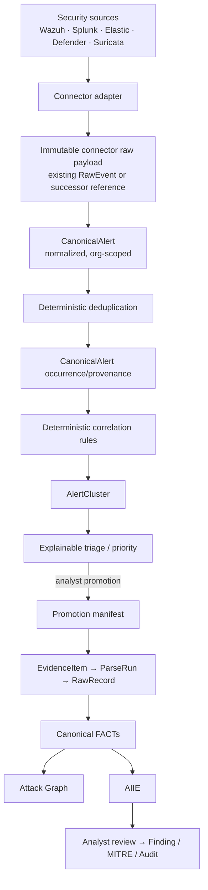

# Phase 7.0 — Alert Correlation & Triage Architecture

Status: **design only; implementation requires approval.** This document does not authorize a migration, API, connector, or behavior change.

> Implementation update — Phase 7.1 is now complete. It adds only immutable CanonicalAlert and occurrence/replay persistence plus a domain creation/read service. No public ingest route, deduplication, correlation, cluster, triage, promotion, FACT, AIIE, Finding, or MITRE behavior was added.

## Repository findings and reuse boundaries

| Existing component | Reuse in Phase 7 | Do not duplicate / change |
| --- | --- | --- |
| `OrgScopedMixin`, `Principal`, permission dependencies | Every alert, cluster, link, query, and job is `org_id` scoped; connector-derived org comes only from the authenticated Connector. | Tenant identity or authorization logic. |
| `InvestigationService.get_investigation` | Promotion authorization and target-case checks. | Investigation lifecycle semantics. |
| `EvidenceItem → EvidenceParseRun → RawRecord → Event/Indicator/Entity/EntityRelationship` | The **only** route by which a promoted alert becomes canonical FACT. | FACT tables, their provenance, immutability, or graph semantics. |
| `EvidenceIngestionService`, parser registry, storage | Adapt a controlled synthetic alert-export file into normal evidence ingestion. | Bypass parsing with direct FACT writes. |
| `AttackGraphService` / canonical graph projection | It receives post-promotion FACTs normally. | Add alert-derived edges to the canonical graph. |
| AIIE (`IntelligenceAnalysis`, Items, Fact Links) | Runs only after a promoted investigation has FACT context. | Alias validation, append-only analysis, review rules, or model behavior. |
| Findings / MITRE / `AuditEvent` | Reuse established analyst review, provenance link, and audit mechanisms. | Treat a cluster score as an analyst verdict. |
| `Connector`, `RawEvent`, connector secret authentication | Extend the connector boundary and retain raw external payload provenance. | Existing webhook endpoint contract until an explicit compatibility migration. |
| Redis configuration | Candidate for bounded asynchronous dispatch only after benchmark evidence. | Introduce Celery/RQ merely because configuration names exist. |

The repository has a **legacy** webhook implementation that synchronously persists `RawEvent` and directly creates an Investigation, legacy evidence/IOC rows, and timeline events. It is not a Phase 7 canonical promotion path. Phase 7 must retain that endpoint until an approved compatibility strategy exists; no new alert implementation may copy its direct-create behavior.

`connector_raw_events` is intake provenance, not canonical `RawRecord`. `investigation_evidence` / legacy `Evidence`, legacy timeline events, and IOC rows must not be counted or reused as canonical FACTs. Alert, AlertCluster, and their membership/link records are also not substitutes for EvidenceItem, Event, Indicator, Entity, or EntityRelationship.

## Target architecture

No arrow from external alert text, cluster score, or AIIE directly writes FACT, a confirmed Finding, or a confirmed MITRE mapping. Alert content is untrusted data throughout this path.

## New logical components

1. **Canonical Alert Foundation** — immutable normalized source alert plus immutable received payload reference and occurrence/replay record.
2. **Deduplication service** — deterministic identity and occurrence aggregation, preserving each source receipt.
3. **Correlation service** — pure deterministic score/rules and explanation records; no LLM dependency.
4. **Alert Cluster service** — org-scoped membership, state, triage facts, and audited merge/split decisions.
5. **Triage scorer** — versioned explainable calculation, separate from AI confidence.
6. **Promotion service** — analyst-controlled idempotent bridge which emits evidence and invokes the existing canonical pipeline.
7. **Connector adapter contract** — external format to CanonicalAlert input only; no correlation, prioritization, or Investigation creation.

See the companion contracts for proposed fields and invariants. These are proposed additions, not implemented schema/API names.

## Security and trust posture

- A connector secret identifies a connector; the connector identifies the organization. Caller-provided `organization_id`, cluster ID, severity, MITRE, or source identity is never authoritative.
- Store exact payloads as untrusted, size-limited JSON/blobs with a digest. Render them encoded/sanitized; never concatenate them into prompts or executable queries.
- Validate a connector-specific source identity and use a replay/idempotency key. Replays create an occurrence/audit event or are safely ignored, never duplicate an Investigation.
- Enforce all correlation candidates with `org_id` equality before scoring. Cross-tenant joining is structurally forbidden.
- Treat source MITRE claims as untrusted detection metadata; they can influence a documented correlation signal but never create confirmed MitreMapping.
- Promotion serializes the selected canonical-alert snapshot, not a live mutable payload. Analyst action, actor, rule/scorer versions, and resulting evidence ID are audited.

## Async and scale decision

The repository configures Redis and Celery broker/result URLs but has no worker implementation. The MVP should keep a bounded, synchronous transaction for validation, raw-payload storage, normalization, exact dedupe, and enqueue intent only if observed ingress latency exceeds the agreed budget. It should not add Celery/RQ in 7.1.

For a later production-scale worker: use a durable outbox/job table (not Redis alone) with idempotency key, attempt count, lease, next-attempt timestamp, terminal failure reason, and dead-letter state; Redis may transport notifications/work but is not the source of truth. Bound payload size, per-connector concurrency, batch candidate queries, retry only transient faults, and expose queue age/backpressure metrics.

## Success measurements

Record, per organization/source/time window: raw alerts received, valid normalized alerts, exact duplicates, repeated occurrences, semantic duplicate candidates accepted/rejected, clusters created/updated, alerts per cluster, promoted clusters/investigations, priority distribution, processing latency, and analyst-visible reduction.

Derived measures include `1 - unique_alerts/raw_alerts`, `1 - clusters/unique_alerts`, false-merge rate (analyst reversals / reviewed merges), and correlation precision/recall where labeled ground truth exists. A benchmark may report `10,000 raw → X unique → Y clusters → Z investigations → N high-priority cases`; those are measured results, never preset targets.
